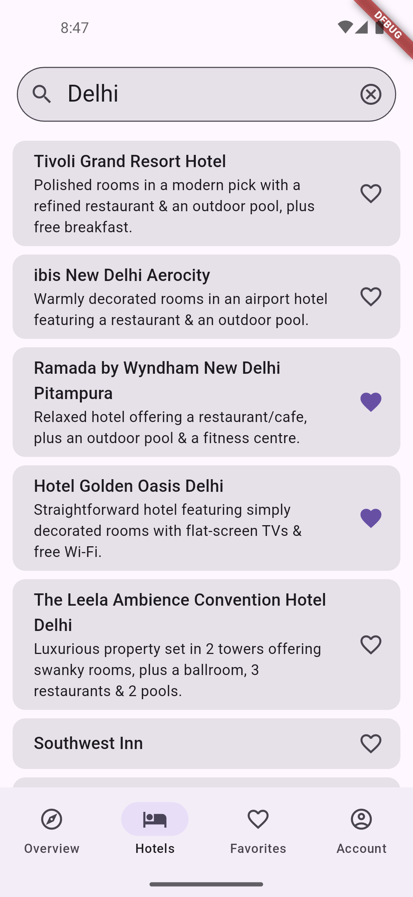
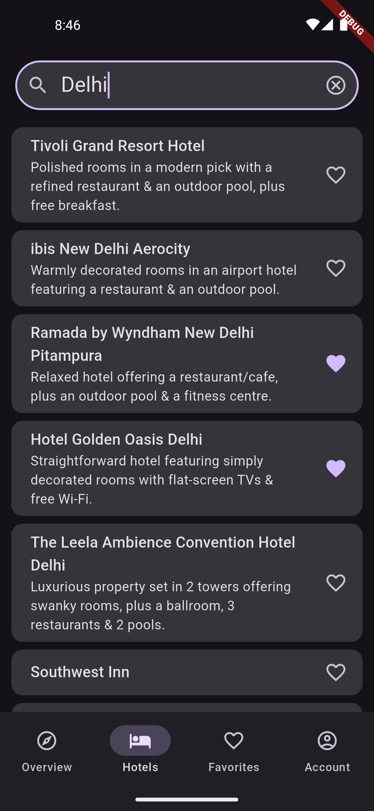
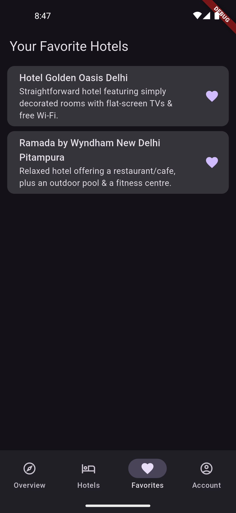

# hotel_booking

## Objective
A small Flutter app for hotel bookings with basic functionality. The goal is to evaluate the understanding of Flutter, state management, error handling, and app architecture.

---

## Setup Instructions

### 1. Clone the Repository
```bash
git clone https://github.com/akshdeep-singh/hotel_booking
cd hotel_booking
```

### 2. Install Dependencies
Run the following command to install the required dependencies:
```bash
flutter pub get
```

### 3. Add [SerpApi Api Key](https://serpapi.com/dashboard) to `.env` File
Create a `.env` file in the root directory and add your SerpAPI key:
```env
SERPAPI_API_KEY=<YOUR_API_KEY>
```

### 4. Run the Dart Code Generator
Generate necessary files using the `build_runner` package:
```bash
flutter pub run build_runner build --delete-conflicting-outputs
```

### 5. Run the App
Start the app on a connected device or emulator:
```bash
flutter run
```

---

## Clean Architecture

### Overview
- Separation of concerns
- Single source of truth
- Unidirectional Data Flow

### Features
- pagination state management using `bloc`
- dependency injection using `injectable`
- limit search requests while typing using `debounce`
- handle pagination requests concurrency using `droppable`

### Folder Structure
```plaintext
lib
├───core
│   ├───di // dependency injection configuration
│   ├───models // common models
│   ├───navigation // auto_route configuration
│   └───network // abstract and implementation of api client
├───features
│   ├───account
│   ├───dashboard
│   ├───favorites
│   │   ├───data
│   │   │   ├───data_sources // abstract data source class & hive implementation
│   │   │   ├───mappers // mapping between models and entities
│   │   │   ├───models // hive data source models
│   │   │   └───repositories // repository implementation
│   │   ├───domain
│   │   │   ├───repositories // abtract repository
│   │   │   └───usecases // use cases to interact with repository
│   │   └───presentation
│   │       ├───bloc // favorites bloc to manage addition, deletion of receiving updates
│   │       └───pages // favorites page
│   ├───hotels
│   │   ├───data
│   │   │   ├───data_sources // abstract data source class and serpapi implementation
│   │   │   ├───mappers // mapping between models and entities
│   │   │   ├───models // serpapi data source models
│   │   │   └───repositories // repository implementation
│   │   ├───domain
│   │   │   ├───entities // entities independent of data layer
│   │   │   ├───repositories // abtract repository
│   │   │   └───usecases // use cases to interact with repository
│   │   └───presentation
│   │       ├───bloc // hotels bloc to manage pagination state and search state
│   │       ├───pages // hotels page
│   │       └───widgets // hotel card and search bar
│   └───overview
└───i18n // localizations
```

## Screenshots

<p float="left">



</p>
